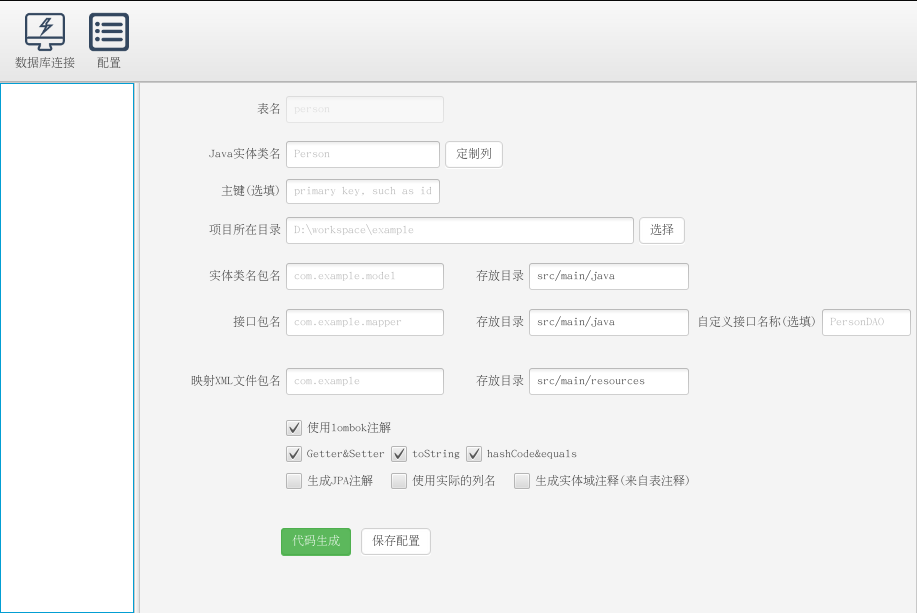

mybatis-generator-gui
==============

对 [zouzg/mybatis-generator-gui](https://github.com/zouzg/mybatis-generator-gui) 做了一些修改:

- 支持lombok注解
- 支持MySQL8
- 修复使用MySQL时，获取其它数据库表的问题
- 修复Ubuntu下字体显示模糊问题

mybatis-generator-gui是基于[mybatis generator](http://www.mybatis.org/generator/index.html)开发一款界面工具, 本工具可以使你非常容易及快速生成Mybatis的Java POJO文件及数据库Mapping文件。



### 要求
运行该程序需要使用JDK <strong>1.8.0.60</strong>以上版本

### 下载
### 启动本软件

* 方法一:  Release

  下载、解压、`java -jar java -jar mybatis-generator-gui.jar`

* 方法二: 自助构建

```bash
    git clone https://github.com/astarring/mybatis-generator-gui
    cd mybatis-generator-gui
    mvn jfx:jar
    cd target/jfx/app/
    java -jar mybatis-generator-gui.jar
```


### 文档
更多详细文档请参考的zouzg/mybatis-generator-gui的Wiki
* [Usage](https://github.com/astarring/mybatis-generator-gui/wiki/Usage-Guide)
